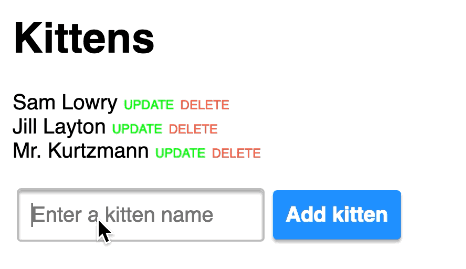

# Next.js (React) + Redux + Express REST API + Postgres SQL boilerplate

## Why is this awesome?

This is a great starting point for a any project where you want **React + Redux** (with server-side rendering, powered by [Next.js](https://github.com/zeit/next.js)) as frontend and **Express/Postgres SQL** as a REST API backend.
_Lightning fast, all JavaScript._

* Simple REST API routes with [`sql-wizard`](https://github.com/tomsoderlund/sql-wizard).
* Redux REST support with `redux-api` and `next-redux-wrapper`.
* Flexible client-side routing with `next-routes` (see `server/routes.js`).
* Flexible configuration with `config/config.js` and `.env` file.
* Hot reloading with `nodemon`.
* Testing with Jasmine.
* Code formatting and linting with StandardJS.
* JWT authentication for client-server communication (coming).

## Demo

See [**nextjs-sql-rest-api-boilerplate** running on Heroku here](https://nextjs-sql-rest-api.herokuapp.com/).

## How to use

Clone this repository:

	git clone https://github.com/tomsoderlund/nextjs-sql-rest-api-boilerplate.git [MY_APP]

Install dependencies:

	cd [MY_APP]
	yarn  # or npm install

Install Postgres and set up the database:

	psql postgres  # Start the Postgres command-line client
	
	CREATE DATABASE "nextjs-sql-rest-api-boilerplate";  -- You can also use \connect to connect to existing database
	CREATE TABLE kitten (id serial, name text);  -- Create a blank table
	INSERT INTO kitten (name) VALUES ('Sphynxie');  -- Add example data
	SELECT * FROM kitten;  -- Check data exists
	\q

Start it by doing the following:

	export DATABASE_URL=[your Postgres URL]  # Or use a .env file
	yarn dev

In production:

	yarn build
	yarn start

If you navigate to `http://localhost:3123/` you will see a [Next.js](https://github.com/zeit/next.js) page with a list of kittens (or an empty list if you haven’t added one).

Your API server is running at `http://localhost:3123/api/kittens`

## Deploying

### Deploying on Heroku

	heroku create [MY_APP]
	heroku addons:create heroku-postgresql:hobby-dev
	git push heroku master

### Deploying on Now

(Coming)
